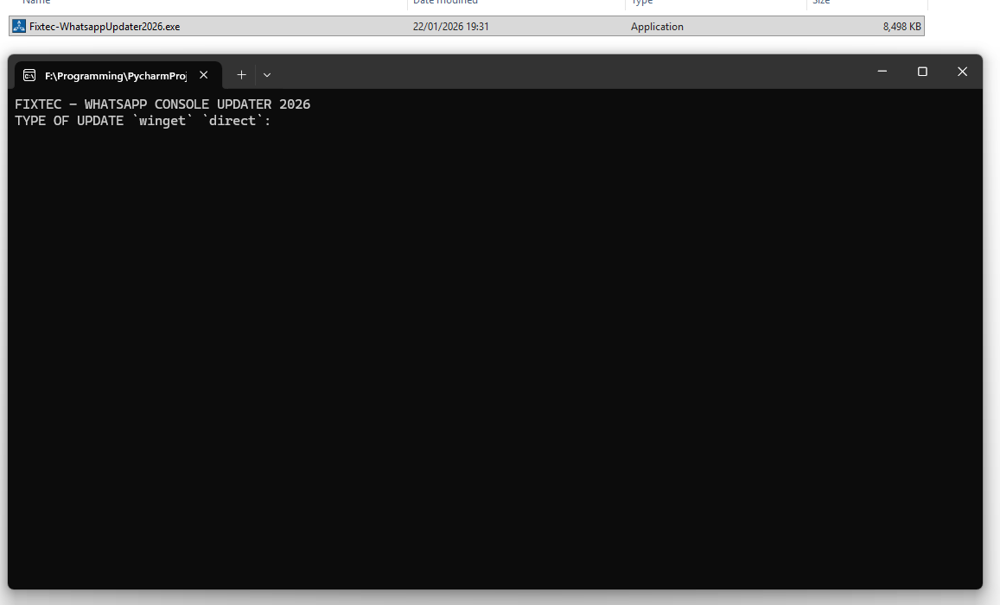

# WhatsApp Desktop Installer (Windows) - for some clients that dont use store.

A small Python script that downloads and installs the **latest WhatsApp Desktop** on **Windows**.

It supports two install methods:

**winget (recommended)** — installs the newest version automatically
**Direct MSIX install** — downloads the latest `.msixbundle` + dependencies and installs using PowerShell

** added auto - if nothing is typed in ;)
**added git action..exe

## Fixes
- 05.02.26 - fixed the delete folder error - using the correct shutil.rmtree, and not remove or rmdir
- 14.02.26 - api cant get cloulflare - bypass? maybe...

## Requirements

- Windows 10/11
- Python 3.8+
- Internet connection dahhh

**Optional (recommended):** 
type
- winget - (Windows Package Manager)
- direct - to use the store.rg
---

## Application Screenshots

